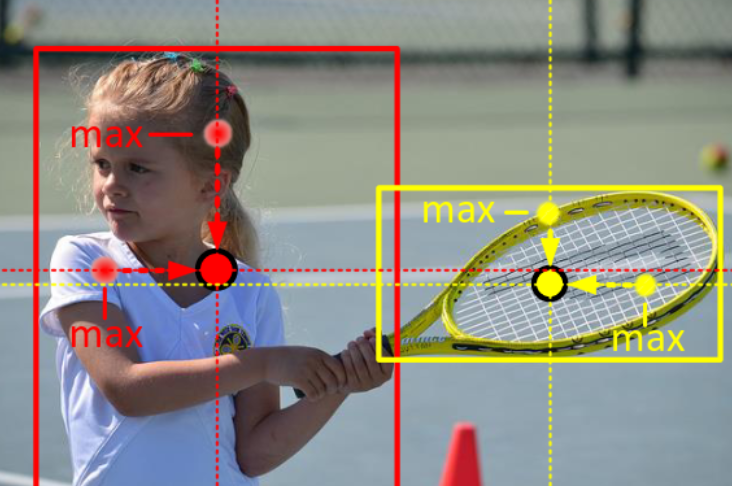

# CenterNet paper review
### official link - [https://arxiv.org/pdf/1904.08189](https://arxiv.org/pdf/1904.08189)

## Object Detection as Keypoint Triplets

Each object is represented by a center keypoint, which we embed as a heatmap and a pair of corners (top-left and bottom-right). After predicting, the top-k bounding boxes are selected, which then are filtered. The procedure of filtering as follows:

 - Remap center keypoint to the original image, with the help of their offsets
 - Define a central region for each bbox and check whether it contains the aforementioned center keypoint
 - If it is inside a central region and the classes are the same, we preserve it, and the score of the bbox will be the averaged of the three point(top-left, center, bottom-right)

Central region in the bbox affects detection results. For example, smaller central regions lead to a low recall rate for small bounding boxes, while larger central regions lead to a low precision for large bounding boxes. A scale-aware central region is proposed, which adresses the issue mentioned before

$$
\begin{align*}
c_{tlx} &= \frac{(n + 1) tlx + (n - 1) brx}{2n} \\
c_{tly} &= \frac{(n + 1) tly + (n - 1) bry}{2n} \\
c_{brx} &= \frac{(n - 1) tlx + (n + 1) brx}{2n} \\
c_{bry} &= \frac{(n - 1) tly + (n + 1) bry}{2n}
\end{align*}
$$

Where $tl_x \text{ and } tl_y$ are the top-left coordinates, $br_x \text{ and } br_y$ are the bottom-right coordinates and $ctl_x, ctl_y, cbr_x \text { and } cbr_y$ are the central regions coordinates and $n$ is an odd number that is the scale of the central region. In CenterNet $n$ is set to be 3 and 5 for scales of bboxes less and grater than 150.

Central Region example:

## Enriching Center and Corner Information

CenterNet uses center pooling and cascade corner pooling as well.

### Center pooling

The backbone outputs a feature map, and to determine if a pixel in the feature map is a center keypoint, we need to find the maximum value in its both horizontal and vertical directions and add them together. By doing this, center pooling helps to better the detection of center keypoints.

### Cascade corner pooling 

As CenterNets cascade corner pooling relies heavily on CornerNets corner pooling, I feel like it is essential to discuss that first. Corner pooling ([CornerNet paper - section 3.4](https://arxiv.org/pdf/1808.01244)), for instance to determine if feature vector **f** is a top-left corner at $(i,j)$, maxpools right to $(i,j)$ and downwards from it, then sums it. 

$$
\begin{align*}
h_1(i, j) &= \max_{k \ge j} f(i, k) \\
h_2(i, j) &= \max_{k \ge i} g(k, j) \\
h(i, j) &= h_1(i, j) + h_2(i, j)
\end{align*}
$$

The same is done for the bottom-right corner, but with upward and leftward pooling and addition. This kind of pooling helps accurately localizing corners, especially in cases where local evidence is insufficient (meaning the objects edges are hard to determine). But this method is sensitive to edges and might miss the internal visual patterns of objects.

Cascade corner pooling enhances the standard method by allowing corners to incorporate internal object features.

- First, find the maximum value along the boundary direction (same as the standard corner pooling).
- Next, look inside the object along the position of the boundary maximum value to find an internal maximum value.
- Finally, add the boundary maximum value and the internal maximum value together.

## Loss

$$L = L_{\text{det}}^\text{co} + L_{\text{det}}^\text{ce} + \alpha L_{\text{pull}}^\text{co} + \beta L_{\text{push}}^\text{co} + \gamma (L_{\text{off}}^\text{co} + L_{\text{off}}^\text{ce})$$

$L_{\text{det}}^\text{co}, L_{\text{det}}^\text{ce}$ denote focal losses used to train the network to detect corners and center keypoints, respectively. This is a focal loss variant defiend in CornerNet, calculated as follows:

$$L_{\text{det}} = -\frac{1}{N} \sum_{c=1}^{C} \sum_{i=1}^{H} \sum_{j=1}^{W} 
\begin{cases}
    (1 - p_{cij})^\alpha \log(p_{cij}) & \text{if } y_{cij} = 1 \\
    (1 - y_{cij})^\beta (p_{cij})^\alpha \log(1 - p_{cij}) & \text{otherwise}
\end{cases}$$

Where $N$ is the number of objects in the image, $C$ is the number of classes, $H$ and $W$ are the width and height of the feature map, and $p_{cij}$ plus $y_{cij}$ are predicted score and gt score at location $(i, j)$ respectively. $α$ and $β$ are hyperparams. It is **important** to mention that $y_{cij}$ (and the predicted $p_{cij}$ as well) is represented as Gaussian bumps, meaning they represent decreasing confidence levels as the location moves away from the actual keypoint.

$L_\text{pull}$ is used to group corners from the same object to have as similar embeddings as possible. Let  $e_{tk}$ be the embedding for the top-left corner of object $k$ and $e_{bk}$ be for the bottom-right corner and $e_k$ is the average of $e_{tk}$ and $e_{bk}$.

$$ L_\text{pull} = \frac{1}{N} \sum_{k=1}^{N} \left[ (e_{tk} - e_k)^2 + (e_{bk} - e_k)^2 \right]$$

$L_\text{push}$ is used to push the unrelated points' embedding far from eachother. $\Delta$ was set to 1.

$$L_{\text{push}} = \frac{1}{N (N - 1)} \sum_{k=1}^{N} \sum_{\substack{j=1 \\ j \ne k}}^{N} \max(0, \Delta - |e_k - e_j|)$$

$L_{off}^{co}$ and $L_{off}^{ce}$ are $l_1$-losses, which are used to train the network to predict the offsets of corners and center keypoints, respectively.